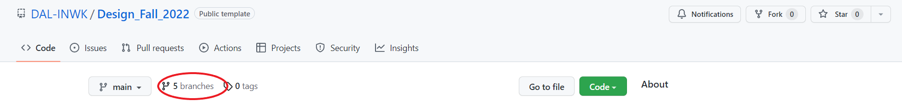
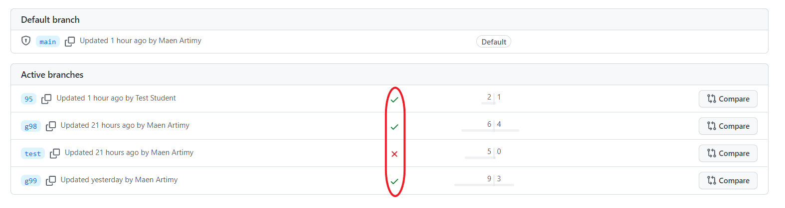

# Automated Network Validation

This repository provides an automated process to checking the validity of network configuration files generated during lab sessions.

To use this repository, each student group need to:

1. Clone the main branch of this repository
2. Create a branch named after their group
3. Copy network device configuration to the branch
4. Commit and push the branch
5. Check if their configuration files have passed the checks

Instructors will also be able to view the results and advise students on how to fix any errors.


## Instructions for students:

Follow these instructions after completing all the lab required configuration steps:

1. Clone the main branch of this repository in the home directory:

   ```
   $ cd
   $ git clone --branch main https://github.com/DAL-INWK/Design_Fall_2022
   ```

2. Create a branch named after your group (use the format gxx, where xx is your group number) and checkout the branch:

   ```
   $ cd Design_Fall_2022
   $ git branch g99
   $ git checkout g99
   ```

3. Copy network device configuration using Ansible:

   ```
   $ export ANSIBLE_HOST_KEY_CHECKING=False
   $ ansible-playbook -i inventory.txt play_backup.yml
   ```

   If the above process was successful (all routers report ok=1), then you will find a folder 'lab1/configs' created in the repository. If the process failed, then it is likely that the SSH configuration on the network devices is not completed and you must follow the instructions in the lab assignment documents to configure SSH.

4. Commit the changes and push the branch:

   ```
   $ git add lab1
   $ git status
    On branch 95
    Changes to be committed:
      (use "git reset HEAD <file>..." to unstage)

            new file:   lab1/configs/R11.cfg
            new file:   lab1/configs/R12.cfg
            new file:   lab1/configs/R21.cfg
            new file:   lab1/configs/R22.cfg
            new file:   lab1/configs/R23.cfg
   $ git commit -m "add config files for group xx"
   $ git push --set-upstream origin 95
   ```

   Note: the last step may require a username/password

5. Check if your configuration files have passed the checks:

   - Go the github [repository](https://github.com/DAL-INWK/Design_Fall_2022)
   - click on 'barnches'   

   

   - Verify that you have a green checkmark in front of your branch. You can click on the checkmark to find details.

   

## Validation Process

This network validation process applies some CI/CD principles to check device configuration against some common configuration errors. The process includes:

\<<To be completed\>>   
